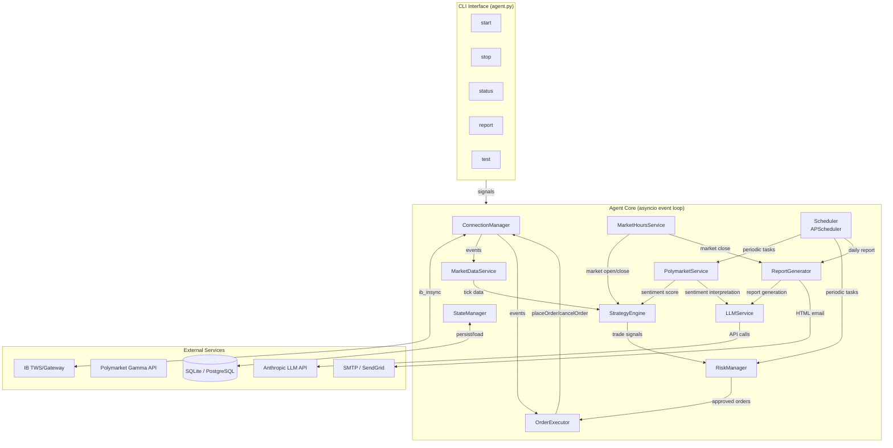
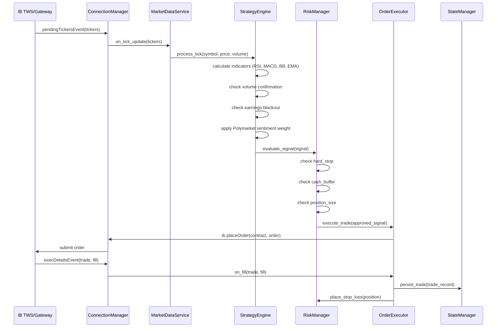
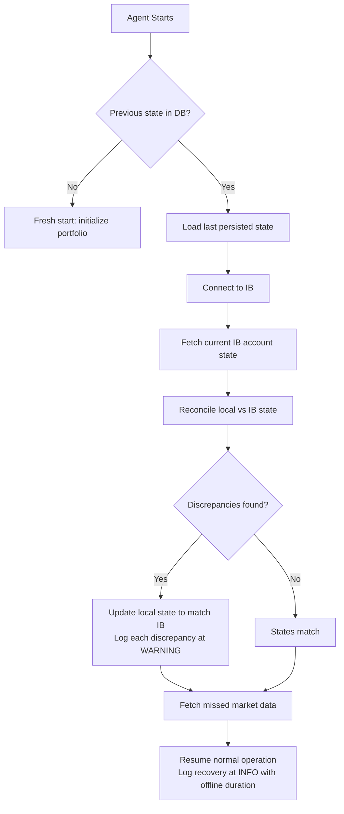

# Design Document: IB Trading Agent

## Overview

This document describes the design of an autonomous trading agent that connects to Interactive Brokers via the `ib_insync` library, streams real-time market data, evaluates multiple trading strategies (momentum, mean reversion, trend following), enforces strict risk management rules, integrates Polymarket sentiment data, and operates as a resilient background service with crash recovery.

The system is built on Python's `asyncio` event loop. The `ib_insync` library provides an event-driven interface to the IB TWS API — the agent subscribes to `pendingTickersEvent` for real-time market data and `execDetailsEvent` / `orderStatusEvent` for trade lifecycle tracking. All I/O is non-blocking. State is persisted to SQLite (or PostgreSQL) after every trade and at regular intervals. The agent runs as a daemon managed by systemd/PM2 with automatic restart on crash.

**Key design decisions:**

1. **Single asyncio event loop** — `ib_insync` owns the event loop via `IB.run()`. All other async work (Polymarket polling, scheduled tasks, risk checks) runs as coroutines on the same loop via APScheduler's `AsyncIOScheduler`.
2. **Event-driven signal pipeline** — Market data flows through a pipeline: `MarketDataService → StrategyEngine → RiskManager → OrderExecutor`. Each stage is a coroutine that processes signals without blocking.
3. **ib_insync as the IB abstraction** — We use `ib_insync` directly rather than wrapping the raw TWS API. It provides automatic state sync (positions, orders, account values), reconnection support, and an event system via `eventkit`.
4. **Polymarket Gamma API** — The public read-only REST API at `https://gamma-api.polymarket.com` provides market data without authentication. We poll it every 15 minutes and compute a sentiment score.
5. **SQLite with WAL mode** — Default persistence uses SQLite in WAL (Write-Ahead Logging) mode for concurrent reads during writes. PostgreSQL is supported via the same repository interface for server deployments.
6. **LLM Hybrid Architecture** — The LLM API (Anthropic claude-sonnet-4-6) is NOT in the critical hot path of trading decisions. All core trading logic (indicators, signals, risk management, order execution) runs as pure Python/NumPy in the Deterministic Layer. The LLM is invoked only for infrequent tasks: Polymarket sentiment interpretation (max 4x/day), daily report generation (1x/day), and unusual market condition analysis (as needed). A hard daily limit (MAX_LLM_CALLS_PER_DAY=10) caps API costs to ~$1-3/month.
7. **NumPy vectorized indicators** — All technical indicator calculations use NumPy vectorized operations. Python for-loops on price arrays are strictly forbidden. Indicator values are cached with a dirty flag mechanism for incremental updates, using `collections.deque` for rolling windows.
8. **Market Screener** — Daily S&P 500 scanning selects top 30 candidates by volume, volatility, and momentum. Runs at 9:00 ET (30 min before market open). Uses Yahoo Finance for free data. Fallback to top 50 by market cap if Wikipedia is blocked.
9. **Yahoo Finance data provider** — Free alternative to IB market data subscriptions for paper trading. Polls 1-minute bars every 10 seconds. Configurable via `MARKET_DATA_TYPE=yahoo` in `.env`.
10. **Crash-resilient main loop** — Agent never exits on its own. Survives IB Gateway crashes, internet outages, and any exception. Reconnects automatically. Only SIGTERM/KeyboardInterrupt can stop it.
11. **RiskManager v2 safety checks** — No short selling, no duplicate positions per symbol, max 90% total portfolio exposure (no margin), 60-second cooldown between trades on same symbol, position tracking after every trade.
12. **AvailableFunds for cash reading** — `_read_portfolio_from_ib()` uses IB's `AvailableFunds` tag instead of `TotalCashBalance` for the cash component. On margin accounts (including paper trading), `TotalCashBalance` is negative, which breaks position sizing. Fallback chain: `AvailableFunds` → `BuyingPower × 0.25` → `NetLiquidation − GrossPositionValue` → `NetLiquidation × 0.10`.
13. **Multi-exchange session manager** — `MarketHoursService` extended with `ExchangeSession` dataclass and `EXCHANGE_SESSIONS` registry supporting US (NYSE/NASDAQ 9:30-16:00 ET), EU (LSE/Eurex 8:00-16:30 GMT), ASIA (TSE 9:00-15:00 JST), US pre-market (4:00-9:30 ET), and US after-hours (16:00-20:00 ET). Configurable via `TRADING_SESSIONS` in `.env`. `_make_contract(symbol)` helper in `market_data_service.py` routes exchange and currency by suffix: `.L`→LSE/GBP, `.T`→TSE/JPY, default→SMART/USD — used by MarketDataService, OrderExecutor, and WatchlistManager. Multi-exchange screener in `market_screener.py` provides `get_ftse100_symbols()` (FTSE 100 from Wikipedia, fallback to top 30), `get_nikkei225_symbols()` (curated top 20), and `screen_for_session()` routing US/EU/ASIA to appropriate symbol lists. Agent screens all configured sessions, portfolio snapshots and loss checks run when any configured session is active. Dashboard JSON includes `activeSessions` and `configuredSessions`. Total: 76 symbols (30 US + 26 EU + 20 ASIA).
14. **Enhanced feature engineering** — Added ATR (volatility), VWAP, trend strength (ADX-like, 0-100), and volume spike detection to the indicator library. All NumPy vectorized. Trend strength filter adjusts momentum and trend following confidence: weak trend (<20) reduces by 30%, strong trend (>40) boosts by 10%.
15. **Volatility-adjusted position sizing** — ATR-based position sizing risks 1% of portfolio per trade (shares = risk_amount / (2×ATR)), capped by existing position size and cash buffer limits. Falls back to fixed sizing when ATR unavailable.
16. **Circuit breaker** — Flash crash protection blocks trades when price moves >10% in a single tick. Integrated into tick processing pipeline before strategy evaluation.

## Architecture



### Component Interaction Flow



## Components and Interfaces

### 1. ConnectionManager

Wraps the `ib_insync.IB` instance. Handles connection lifecycle, reconnection, and environment validation.

```python
class ConnectionManager:
    """Manages IB API connection via ib_insync."""

    def __init__(self, config: AgentConfig):
        self.ib = IB()
        self.config = config
        self._reconnect_attempts = 0
        self._max_reconnect_attempts = 5

    async def connect(self) -> None:
        """Connect to IB TWS/Gateway using config parameters.
        Validates ENVIRONMENT setting before connecting.
        Paper mode: port 7497 (TWS) or 4002 (Gateway).
        Live mode: port 7496 (TWS) or 4001 (Gateway)."""

    async def disconnect(self) -> None:
        """Gracefully disconnect from IB."""

    async def _on_disconnected(self) -> None:
        """Handle disconnection. Attempt reconnect up to 5 times
        with 30-second intervals. After 5 failures, send alert
        email and retry every 60 seconds."""

    def is_connected(self) -> bool:
        """Check connection status."""
```

**Key ib_insync integration points:**
- `IB.connect(host, port, clientId)` — blocking connect that syncs state
- `IB.disconnectedEvent` — fires on connection loss, triggers reconnect logic
- `IB.connectedEvent` — fires after successful reconnect, triggers re-subscription
- `IB.errorEvent` — captures TWS error codes for logging

### 2. MarketDataService

Subscribes to real-time streaming data for all watchlist symbols using `IB.reqMktData()`. Publishes processed tick data to the StrategyEngine.

```python
class MarketDataService:
    """Streams and processes real-time market data from IB."""

    def __init__(self, ib: IB, watchlist: List[str]):
        self._ib = ib
        self._watchlist = watchlist
        self._contracts: Dict[str, Contract] = {}
        self._price_history: Dict[str, deque] = {}  # rolling window per symbol

    async def subscribe_all(self) -> None:
        """Qualify contracts and subscribe to market data for all
        watchlist symbols. Uses genericTickList='233,165' for
        volume and Time&Sales data."""

    async def unsubscribe_all(self) -> None:
        """Cancel all market data subscriptions."""

    def on_pending_tickers(self, tickers: Set[Ticker]) -> None:
        """Callback for IB.pendingTickersEvent. Extracts price/volume
        from each ticker and forwards to StrategyEngine.
        Target: < 100ms from receipt to strategy dispatch."""

    def get_price_history(self, symbol: str, periods: int) -> List[float]:
        """Return last N closing prices for indicator calculation."""

    def get_volume_history(self, symbol: str, periods: int) -> List[float]:
        """Return last N volume values for volume analysis."""
```

**Design rationale:** We use `reqMktData()` with streaming (not snapshots) to get continuous tick updates. The `pendingTickersEvent` fires after each network packet is processed, giving us batched updates that are efficient to handle. We request generic tick type 233 (Time & Sales: last, lastSize, rtVolume, vwap) and 165 (avVolume for 20-day average volume).

### 3. StrategyEngine

Evaluates three strategies on each tick update, applies volume confirmation and earnings blackout filters, and incorporates Polymarket sentiment.

```python
class StrategyEngine:
    """Evaluates trading strategies and generates signals."""

    def __init__(self, risk_manager: RiskManager,
                 polymarket_service: PolymarketService,
                 earnings_calendar: EarningsCalendar,
                 market_hours: MarketHoursService,
                 indicator_cache: IndicatorCache):
        self._risk_manager = risk_manager
        self._polymarket = polymarket_service
        self._earnings = earnings_calendar
        self._market_hours = market_hours
        self._indicator_cache = indicator_cache

    async def process_tick(self, symbol: str, price: float,
                           volume: float, prices: List[float],
                           volumes: List[float]) -> Optional[TradeSignal]:
        """Main entry point. Runs all strategies, applies filters,
        returns a TradeSignal or None."""

    def _calculate_rsi(self, prices: List[float], period: int = 14) -> float:
        """RSI using Wilder's smoothing method. NumPy vectorized."""

    def _calculate_macd(self, prices: List[float],
                        fast: int = 12, slow: int = 26,
                        signal: int = 9) -> Tuple[float, float, float]:
        """Returns (macd_line, signal_line, histogram). NumPy vectorized."""

    def _calculate_bollinger_bands(self, prices: List[float],
                                    period: int = 20,
                                    std_dev: float = 2.0
                                    ) -> Tuple[float, float, float]:
        """Returns (upper_band, middle_band, lower_band). NumPy vectorized."""

    def _calculate_ema(self, prices: List[float],
                       period: int) -> float:
        """Exponential Moving Average. Uses np.convolve() or pandas ewm()."""

    def _check_volume_confirmation(self, current_volume: float,
                                    avg_volume: float) -> bool:
        """Returns True if current_volume >= 1.5 * avg_volume."""

    def _check_earnings_blackout(self, symbol: str) -> bool:
        """Returns True if symbol is within earnings blackout window
        (2 days before, 1 day after)."""

    def _apply_sentiment_weight(self, signal: TradeSignal,
                                 sentiment: float) -> TradeSignal:
        """Adjust signal confidence by Polymarket sentiment score.
        Sentiment is secondary — never triggers a trade alone."""
```

**Signal generation logic:**
- **Momentum BUY:** RSI crosses above 30 from below AND MACD histogram turns positive AND volume confirmed
- **Momentum SELL:** RSI crosses below 70 from above AND MACD histogram turns negative AND volume confirmed
- **Mean Reversion BUY:** Price crosses below lower Bollinger Band AND volume confirmed
- **Mean Reversion SELL:** Price crosses above upper Bollinger Band AND volume confirmed
- **Trend Following BUY:** 9-EMA crosses above 21-EMA AND volume confirmed
- **Trend Following SELL:** 9-EMA crosses below 21-EMA AND volume confirmed

When multiple strategies agree on direction, signal confidence increases. The Polymarket sentiment score (−1.0 to +1.0) adjusts confidence as a multiplier but cannot independently trigger a trade.

### 4. RiskManager

Enforces all risk limits in a strict order before any trade is executed.

```python
class RiskManager:
    """Enforces portfolio risk limits and manages stop-loss orders."""

    def __init__(self, config: AgentConfig, ib: IB,
                 state_manager: StateManager):
        self._config = config
        self._ib = ib
        self._state = state_manager
        self._hard_stop_active = False
        self._initial_portfolio_value: Optional[float] = None

    async def evaluate_signal(self, signal: TradeSignal) -> Optional[ApprovedTrade]:
        """Validate signal against risk limits in order:
        1. Hard stop check (portfolio loss >= MAX_PORTFOLIO_LOSS_PCT)
        2. Cash buffer check (cash >= CASH_BUFFER_PCT)
        3. Position size check (position <= MAX_POSITION_SIZE_PCT)
        4. Stop-loss readiness
        Returns ApprovedTrade or None with logged rejection reason."""

    async def check_portfolio_loss(self) -> None:
        """Called every minute during market hours.
        If loss >= threshold, trigger hard stop."""

    async def trigger_hard_stop(self) -> None:
        """Close all positions via market orders, disable trading,
        log ERROR, send alert email."""

    async def place_stop_loss(self, symbol: str, entry_price: float,
                               quantity: int, order_id: int) -> None:
        """Place initial stop-loss at entry_price * (1 - STOP_LOSS_PCT/100).
        Retry up to 3 times on failure, then use market order."""

    async def upgrade_to_trailing_stop(self, symbol: str,
                                        current_price: float) -> None:
        """When unrealized gain > 3%, convert fixed stop-loss to
        trailing stop with trail = STOP_LOSS_PCT% of current price."""

    def calculate_position_size(self, price: float) -> int:
        """Calculate max shares buyable within position size and
        cash buffer constraints."""
```

**Risk check order (non-negotiable):**
1. Is hard stop triggered? → HALT all trading
2. Would trade violate cash buffer (< 10% cash remaining)? → REJECT
3. Would trade exceed max position size (> 25% of portfolio)? → REJECT
4. Is stop-loss order configured? → REQUIRED before entry

### 5. OrderExecutor

Submits orders to IB and tracks their lifecycle.

```python
class OrderExecutor:
    """Submits and tracks orders via ib_insync."""

    def __init__(self, ib: IB, risk_manager: RiskManager,
                 state_manager: StateManager):
        self._ib = ib
        self._risk_manager = risk_manager
        self._state = state_manager

    async def execute_trade(self, trade: ApprovedTrade) -> Optional[Trade]:
        """Place a market order via IB. On fill, immediately place
        stop-loss order. Persist trade record to StateManager."""

    def _on_exec_details(self, trade: Trade, fill: Fill) -> None:
        """Callback for IB.execDetailsEvent. Records fill details
        and triggers stop-loss placement."""

    def _on_order_status(self, trade: Trade) -> None:
        """Callback for IB.orderStatusEvent. Logs status changes."""

    async def cancel_all_pending(self) -> None:
        """Cancel all open orders. Used during graceful shutdown
        and hard stop."""
```

### 6. MarketHoursService

Determines whether the market is open using exchange calendar data.

```python
class MarketHoursService:
    """Tracks NYSE/NASDAQ regular trading hours."""

    def __init__(self, ib: IB):
        self._ib = ib
        self._is_market_open = False

    async def update_schedule(self) -> None:
        """Fetch trading schedule from IB using
        reqHistoricalSchedule() for a reference contract.
        Parses liquidHours from ContractDetails."""

    def is_market_open(self) -> bool:
        """Returns True during regular market hours (9:30-16:00 ET)."""

    def next_market_open(self) -> datetime:
        """Returns datetime of next market open."""

    def next_market_close(self) -> datetime:
        """Returns datetime of next market close."""
```

**Design rationale:** We use `IB.reqContractDetails()` to get `liquidHours` for a reference stock contract (e.g., SPY). This gives us the actual exchange schedule including holidays, rather than hardcoding timezone offsets.

### 7. PolymarketService

Fetches prediction market data from the Polymarket Gamma API and computes a sentiment score.

```python
class PolymarketService:
    """Fetches and scores Polymarket prediction market data."""

    GAMMA_API_BASE = "https://gamma-api.polymarket.com"
    RELEVANT_TAGS = ["economics", "politics", "fed", "inflation",
                     "recession", "interest-rates"]

    def __init__(self):
        self._sentiment_score: float = 0.0
        self._last_fetch: Optional[datetime] = None
        self._session: Optional[aiohttp.ClientSession] = None

    async def fetch_markets(self) -> List[dict]:
        """GET /markets?active=true&closed=false&tag=<tag>
        for each relevant tag. No authentication required."""

    def compute_sentiment(self, markets: List[dict]) -> float:
        """Aggregate market probabilities into a score from
        -1.0 (strongly bearish) to +1.0 (strongly bullish).
        Weight by volume and recency."""

    async def update(self) -> None:
        """Called every 15 minutes by scheduler.
        On API failure, keep last score and log WARNING."""

    @property
    def sentiment_score(self) -> float:
        """Current sentiment score."""
        return self._sentiment_score

    @property
    def last_fetch_time(self) -> Optional[datetime]:
        """Timestamp of last successful fetch."""
        return self._last_fetch
```

**Polymarket Gamma API details:**
- Base URL: `https://gamma-api.polymarket.com`
- Endpoint: `GET /markets?active=true&closed=false&limit=100`
- Response: JSON array of market objects with `outcomePrices`, `volume`, `question`, `tags`
- No authentication required for read-only access
- Rate limits are generous for 15-minute polling intervals

### 8. StateManager

Handles all database persistence and crash recovery.

```python
class StateManager:
    """Persists agent state to SQLite or PostgreSQL."""

    def __init__(self, config: AgentConfig):
        self._db_url = config.db_url  # sqlite:///data/agent.db or postgresql://...
        self._engine: Optional[Engine] = None

    async def initialize(self) -> None:
        """Create tables if not exist. Enable WAL mode for SQLite."""

    async def persist_trade(self, trade: TradeRecord) -> None:
        """Save trade record within 1 second of execution."""

    async def persist_portfolio_snapshot(self, snapshot: PortfolioSnapshot) -> None:
        """Save portfolio state. Called after every trade and
        every 5 minutes during market hours."""

    async def persist_analysis_state(self, state: AnalysisState) -> None:
        """Save watchlist, active signals, indicator values."""

    async def load_last_state(self) -> Optional[AgentState]:
        """Load most recent state for crash recovery."""

    async def reconcile_with_ib(self, ib: IB) -> List[Discrepancy]:
        """Compare persisted state with live IB account state.
        Update local state to match IB. Log each discrepancy."""
```

### 9. ReportGenerator

Produces daily HTML email reports.

```python
class ReportGenerator:
    """Generates and sends daily HTML email reports."""

    def __init__(self, config: AgentConfig,
                 state_manager: StateManager):
        self._config = config
        self._state = state_manager

    async def generate_report(self) -> str:
        """Build HTML report with: portfolio value, daily P&L,
        trade list, top 3 winners/losers, open positions,
        Polymarket sentiment summary, warning banners."""

    async def send_report(self, html: str) -> None:
        """Send via SMTP (smtplib) or SendGrid API.
        Uses config EMAIL_SMTP_* parameters."""

    def _render_warning_banner(self, loss_pct: float) -> str:
        """WARNING banner at >10% loss, CRITICAL at >20%."""
```

### 10. CLIInterface

Entry point for the `python agent.py <command>` interface.

```python
class CLIInterface:
    """Command-line interface for agent control."""

    @staticmethod
    def start() -> None:
        """Start agent as background process. Log startup at INFO."""

    @staticmethod
    def stop() -> None:
        """Send SIGTERM to running agent process for graceful shutdown."""

    @staticmethod
    def status() -> None:
        """Display portfolio value, cash, open positions, agent state."""

    @staticmethod
    def report() -> None:
        """Generate and send report immediately."""
```

### 11. LLMService

Manages all interactions with the Anthropic LLM API. Enforces the daily call limit and logs token usage for cost tracking.

```python
class LLMService:
    """Manages LLM API calls with rate limiting and cost tracking."""

    def __init__(self, config: AgentConfig):
        self._config = config
        self._client: Optional[anthropic.AsyncAnthropic] = None
        self._daily_call_count: int = 0
        self._last_reset_date: Optional[date] = None

    async def initialize(self) -> None:
        """Initialize the Anthropic async client.
        Uses ANTHROPIC_API_KEY from environment."""

    async def interpret_sentiment(self, polymarket_data: List[dict],
                                   news_context: str) -> str:
        """Interpret Polymarket sentiment and news.
        Called max 4x daily by PolymarketService.
        Returns structured sentiment analysis."""

    async def generate_report_content(self, portfolio_data: dict,
                                       trades: List[TradeRecord]) -> str:
        """Generate narrative content for daily email report.
        Called 1x daily by ReportGenerator."""

    async def interpret_unusual_conditions(self, market_data: dict) -> str:
        """Interpret unusual market conditions that don't match
        known patterns. Called exceptionally, as needed."""

    async def _call_llm(self, purpose: str, messages: List[dict]) -> str:
        """Internal method to make an LLM API call.
        Checks daily limit (MAX_LLM_CALLS_PER_DAY).
        If limit reached, skip and log WARNING.
        On success, log INFO with purpose, model, input/output/total tokens.
        On API error, log WARNING and return empty string.
        Resets daily counter at midnight."""

    def _reset_daily_counter_if_needed(self) -> None:
        """Reset call counter if date has changed."""

    @property
    def daily_calls_remaining(self) -> int:
        """Number of LLM calls remaining today."""
        return max(0, self._config.max_llm_calls_per_day - self._daily_call_count)
```

**Key design decisions:**
- Uses `anthropic.AsyncAnthropic` for non-blocking API calls
- Hard daily limit enforced at the service level — no caller can bypass it
- Every call is logged with full token counts for cost tracking
- On API failure, the deterministic layer continues unaffected
- Daily counter resets at midnight local time

### 12. IndicatorCache

Caches calculated indicator values and supports incremental updates with dirty flag mechanism.

```python
class IndicatorCache:
    """Caches indicator values with dirty flag for incremental updates."""

    def __init__(self):
        self._cache: Dict[str, Dict[str, Any]] = {}  # symbol -> {indicator_name: value}
        self._dirty_flags: Dict[str, Dict[str, bool]] = {}  # symbol -> {indicator_name: is_dirty}
        self._price_windows: Dict[str, deque] = {}  # symbol -> rolling price deque
        self._volume_windows: Dict[str, deque] = {}  # symbol -> rolling volume deque

    def update_price(self, symbol: str, price: float) -> None:
        """Append new price to rolling window. Mark all indicators
        for this symbol as dirty."""

    def update_volume(self, symbol: str, volume: float) -> None:
        """Append new volume to rolling window. Mark volume-dependent
        indicators as dirty."""

    def get_indicator(self, symbol: str, indicator_name: str) -> Optional[float]:
        """Return cached value if not dirty. Return None if dirty
        (caller must recalculate)."""

    def set_indicator(self, symbol: str, indicator_name: str,
                      value: Any) -> None:
        """Store calculated value and clear dirty flag."""

    def is_dirty(self, symbol: str, indicator_name: str) -> bool:
        """Check if indicator needs recalculation."""

    def get_prices(self, symbol: str) -> Optional[np.ndarray]:
        """Return price window as NumPy array for vectorized calculation."""

    def get_volumes(self, symbol: str) -> Optional[np.ndarray]:
        """Return volume window as NumPy array for vectorized calculation."""
```

### 13. AgentConfig

Loads and validates configuration from `.env`.

```python
@dataclass
class AgentConfig:
    """All configuration from .env file."""
    ib_account_id: str          # required
    ib_host: str                # required
    ib_port: int                # required
    environment: str            # required: "paper" or "live"
    email_address: str
    email_smtp_host: str
    email_smtp_port: int
    email_smtp_user: str
    email_smtp_password: str
    max_portfolio_loss_pct: float = 20.0
    max_position_size_pct: float = 25.0
    stop_loss_pct: float = 5.0
    cash_buffer_pct: float = 10.0
    db_url: str = "sqlite:///data/agent.db"
    llm_model: str = "claude-sonnet-4-6"
    max_llm_calls_per_day: int = 10

    @classmethod
    def from_env(cls, path: str = ".env") -> "AgentConfig":
        """Load from .env file. Validate required fields.
        Exit with error if required fields missing or
        ENVIRONMENT is not 'paper' or 'live'."""
```

## Data Models

### Database Schema

```sql
-- Trade records
CREATE TABLE trades (
    id INTEGER PRIMARY KEY AUTOINCREMENT,
    symbol TEXT NOT NULL,
    direction TEXT NOT NULL CHECK(direction IN ('BUY', 'SELL')),
    entry_price REAL NOT NULL,
    exit_price REAL,
    quantity INTEGER NOT NULL,
    stop_loss_price REAL NOT NULL,
    strategy TEXT NOT NULL,
    signal_confidence REAL,
    polymarket_sentiment REAL,
    status TEXT NOT NULL DEFAULT 'OPEN'
        CHECK(status IN ('OPEN', 'CLOSED', 'STOPPED_OUT')),
    entry_time TEXT NOT NULL,
    exit_time TEXT,
    realized_pnl REAL,
    created_at TEXT NOT NULL DEFAULT (datetime('now'))
);

-- Portfolio snapshots
CREATE TABLE portfolio_snapshots (
    id INTEGER PRIMARY KEY AUTOINCREMENT,
    total_value REAL NOT NULL,
    cash_balance REAL NOT NULL,
    positions_value REAL NOT NULL,
    daily_pnl REAL,
    total_pnl REAL,
    total_pnl_pct REAL,
    num_open_positions INTEGER NOT NULL,
    hard_stop_active INTEGER NOT NULL DEFAULT 0,
    snapshot_time TEXT NOT NULL,
    created_at TEXT NOT NULL DEFAULT (datetime('now'))
);

-- Analysis state (watchlist, signals, indicators)
CREATE TABLE analysis_state (
    id INTEGER PRIMARY KEY AUTOINCREMENT,
    watchlist_json TEXT NOT NULL,
    active_signals_json TEXT NOT NULL,
    indicator_values_json TEXT NOT NULL,
    polymarket_sentiment REAL,
    polymarket_last_fetch TEXT,
    updated_at TEXT NOT NULL DEFAULT (datetime('now'))
);

-- Earnings calendar cache
CREATE TABLE earnings_calendar (
    id INTEGER PRIMARY KEY AUTOINCREMENT,
    symbol TEXT NOT NULL,
    earnings_date TEXT NOT NULL,
    source TEXT NOT NULL,
    fetched_at TEXT NOT NULL DEFAULT (datetime('now')),
    UNIQUE(symbol, earnings_date)
);

-- Agent operational state
CREATE TABLE agent_state (
    id INTEGER PRIMARY KEY AUTOINCREMENT,
    state TEXT NOT NULL CHECK(state IN ('RUNNING', 'STOPPED', 'HALTED')),
    initial_portfolio_value REAL,
    start_time TEXT NOT NULL,
    last_heartbeat TEXT NOT NULL,
    crash_count INTEGER NOT NULL DEFAULT 0,
    created_at TEXT NOT NULL DEFAULT (datetime('now'))
);

-- LLM API call tracking
CREATE TABLE llm_calls (
    id INTEGER PRIMARY KEY AUTOINCREMENT,
    purpose TEXT NOT NULL,
    model TEXT NOT NULL,
    input_tokens INTEGER NOT NULL,
    output_tokens INTEGER NOT NULL,
    total_tokens INTEGER NOT NULL,
    success INTEGER NOT NULL DEFAULT 1,
    error_message TEXT,
    call_date TEXT NOT NULL,
    created_at TEXT NOT NULL DEFAULT (datetime('now'))
);
```

### Domain Objects

```python
@dataclass
class TradeSignal:
    symbol: str
    direction: str          # "BUY" or "SELL"
    strategy: str           # "momentum", "mean_reversion", "trend_following"
    confidence: float       # 0.0 to 1.0
    price: float
    volume: float
    indicators: Dict[str, float]  # RSI, MACD, BB values, etc.
    polymarket_sentiment: float
    timestamp: datetime

@dataclass
class ApprovedTrade:
    signal: TradeSignal
    quantity: int
    stop_loss_price: float
    max_position_value: float

@dataclass
class TradeRecord:
    symbol: str
    direction: str
    entry_price: float
    quantity: int
    stop_loss_price: float
    strategy: str
    signal_confidence: float
    polymarket_sentiment: float
    entry_time: datetime
    exit_price: Optional[float] = None
    exit_time: Optional[datetime] = None
    realized_pnl: Optional[float] = None
    status: str = "OPEN"

@dataclass
class PortfolioSnapshot:
    total_value: float
    cash_balance: float
    positions_value: float
    daily_pnl: float
    total_pnl: float
    total_pnl_pct: float
    num_open_positions: int
    hard_stop_active: bool
    snapshot_time: datetime

@dataclass
class Discrepancy:
    field: str
    local_value: Any
    ib_value: Any
    resolution: str  # "updated_to_ib"
```


## Correctness Properties

*A property is a characteristic or behavior that should hold true across all valid executions of a system — essentially, a formal statement about what the system should do. Properties serve as the bridge between human-readable specifications and machine-verifiable correctness guarantees.*

### Property 1: Technical indicator bounds

*For any* valid price sequence of sufficient length, the RSI calculation SHALL produce a value in [0, 100], the Bollinger Bands SHALL satisfy upper_band > middle_band > lower_band with middle_band equal to the SMA, and the EMA SHALL produce a value between the minimum and maximum of the input prices.

**Validates: Requirements 4.1, 4.2, 5.1, 6.1**

### Property 2: No trades outside market hours

*For any* trade signal generated while the market hours service reports the market as closed, the agent SHALL suppress the signal and not execute any trade.

**Validates: Requirements 2.4, 3.2**

### Property 3: Momentum signal correctness

*For any* price sequence where the RSI crosses above 30 from below and the MACD histogram transitions from negative to positive, the strategy engine SHALL generate a BUY momentum signal; and for any price sequence where the RSI crosses below 70 from above and the MACD histogram transitions from positive to negative, the strategy engine SHALL generate a SELL momentum signal.

**Validates: Requirements 4.3, 4.4**

### Property 4: Mean reversion signal correctness

*For any* price sequence where the current price crosses below the lower Bollinger Band, the strategy engine SHALL generate a BUY mean-reversion signal; and for any price sequence where the current price crosses above the upper Bollinger Band, the strategy engine SHALL generate a SELL mean-reversion signal.

**Validates: Requirements 5.2, 5.3**

### Property 5: Trend following signal correctness

*For any* price sequence where the 9-period EMA crosses above the 21-period EMA, the strategy engine SHALL generate a BUY trend-following signal; and for any price sequence where the 9-period EMA crosses below the 21-period EMA, the strategy engine SHALL generate a SELL trend-following signal.

**Validates: Requirements 6.2, 6.3**

### Property 6: Volume confirmation filter

*For any* trade signal and any pair of (current_volume, average_20day_volume), if current_volume < 1.5 × average_20day_volume, then the signal SHALL be rejected.

**Validates: Requirements 7.1**

### Property 7: Watchlist volume filter

*For any* set of candidate stocks with varying average daily volumes, the watchlist SHALL include only those stocks whose average daily volume exceeds 500,000 shares.

**Validates: Requirements 7.2**

### Property 8: Earnings blackout suppression

*For any* stock and any pair of (current_date, earnings_date), if current_date falls within 2 trading days before or 1 trading day after the earnings_date, then all trade signals for that stock SHALL be suppressed.

**Validates: Requirements 8.2**

### Property 9: Hard stop activation and enforcement

*For any* portfolio state where the loss percentage relative to the initial portfolio value reaches or exceeds MAX_PORTFOLIO_LOSS_PCT, the hard stop SHALL activate; and while the hard stop is active, *for any* incoming trade signal, the risk manager SHALL reject it.

**Validates: Requirements 9.2, 9.4**

### Property 10: Stop-loss price calculation

*For any* entry price and STOP_LOSS_PCT value, the stop-loss order price SHALL equal entry_price × (1 − STOP_LOSS_PCT / 100).

**Validates: Requirements 10.1**

### Property 11: Trailing stop conversion threshold

*For any* open position with entry_price and current_price, if (current_price − entry_price) / entry_price > 0.03 (3% gain), then the risk manager SHALL convert the fixed stop-loss to a trailing stop-loss.

**Validates: Requirements 11.1**

### Property 12: Risk limit enforcement

*For any* proposed trade, if the proposed position value would exceed MAX_POSITION_SIZE_PCT of total portfolio value, or if executing the trade would reduce cash below CASH_BUFFER_PCT of total portfolio value, then the risk manager SHALL reject the trade.

**Validates: Requirements 12.1, 12.2**

### Property 13: Risk check evaluation order

*For any* proposed trade that violates multiple risk limits simultaneously, the risk manager SHALL report the rejection reason corresponding to the first violated limit in the evaluation order: hard stop → cash buffer → position size → stop-loss readiness.

**Validates: Requirements 12.4**

### Property 14: Sentiment score bounds and independence

*For any* set of Polymarket market data, the computed sentiment score SHALL be in the range [−1.0, +1.0]; and *for any* sentiment score without an accompanying strategy signal, no trade SHALL be triggered.

**Validates: Requirements 13.2, 13.3**

### Property 15: State reconciliation convergence

*For any* pair of (persisted_local_state, current_ib_state), after reconciliation the local state SHALL match the IB account state for all positions, fills, and order statuses.

**Validates: Requirements 16.2, 16.3**

### Property 16: Configuration validation

*For any* .env file content, the agent SHALL apply default values (MAX_PORTFOLIO_LOSS_PCT=20, MAX_POSITION_SIZE_PCT=25, STOP_LOSS_PCT=5, CASH_BUFFER_PCT=10, LLM_MODEL=claude-sonnet-4-6, MAX_LLM_CALLS_PER_DAY=10) for missing optional parameters; SHALL reject and exit with non-zero code if any required parameter (IB_ACCOUNT_ID, IB_HOST, IB_PORT, ENVIRONMENT) is missing; and SHALL reject and exit with non-zero code if ENVIRONMENT is not "paper" or "live".

**Validates: Requirements 1.4, 19.2, 19.3, 19.4**

### Property 17: LLM daily call limit enforcement

*For any* sequence of LLM API call requests within a single calendar day, once the number of completed calls reaches MAX_LLM_CALLS_PER_DAY, all subsequent LLM call requests SHALL be skipped (returning a fallback response) and a WARNING SHALL be logged. The daily counter SHALL reset at the start of each new calendar day.

**Validates: Requirements 23.5, 23.6**

### Property 18: Deterministic layer independence from LLM

*For any* state where the LLM_Service is unavailable (API error, rate limit reached, network failure), the Deterministic_Layer SHALL continue to calculate indicators, generate signals, enforce risk limits, execute orders, and persist state without interruption or degradation.

**Validates: Requirements 23.1, 23.2, 23.7**

### Property 19: NumPy indicator equivalence

*For any* valid price sequence of sufficient length, the NumPy vectorized indicator calculations SHALL produce results numerically equivalent (within floating-point tolerance of 1e-10) to a reference iterative implementation for RSI, MACD, EMA, and Bollinger Bands.

**Validates: Requirements 24.3**

### Property 20: Indicator cache consistency

*For any* sequence of price updates for a symbol, the cached indicator value (when not dirty) SHALL equal the value that would be computed from the current price window. After a price update, the dirty flag for all dependent indicators SHALL be set to True.

**Validates: Requirements 24.4, 24.6**

## Error Handling

### Connection Errors

| Error | Handling | Requirement |
|-------|----------|-------------|
| IB connection lost | Auto-reconnect within 30s using ib_insync keep-alive. Retry up to 5 times. | 1.2, 1.3 |
| 5 consecutive reconnect failures | Log ERROR, send alert email, enter waiting state with 60s retry interval. | 1.3 |
| IB error codes 1100 (connectivity lost), 1102 (restored) | Log at appropriate level, trigger reconnect flow. | 1.2 |

### Trading Errors

| Error | Handling | Requirement |
|-------|----------|-------------|
| Stop-loss order submission failure | Retry up to 3 times. If still failing, close position with market order. | 10.3 |
| Order rejected by IB | Log ERROR with rejection reason, do not retry. | — |
| Insufficient margin | Log WARNING, reject trade, notify via daily report. | — |

### External Service Errors

| Error | Handling | Requirement |
|-------|----------|-------------|
| Polymarket API unavailable | Use last successfully fetched sentiment score. Log WARNING with last fetch timestamp. | 13.4 |
| LLM API unavailable or error | Log WARNING. Deterministic layer continues without interruption. Skip LLM step. | 23.7 |
| LLM daily call limit reached | Skip LLM step, log WARNING with current call count. Deterministic layer unaffected. | 23.5 |
| SMTP/SendGrid failure | Log ERROR, retry once after 60s. Store report HTML locally for manual review. | — |
| Database write failure | Log ERROR, retry with exponential backoff (1s, 2s, 4s). If persistent, halt trading to prevent state loss. | — |

### Shutdown Errors

| Error | Handling | Requirement |
|-------|----------|-------------|
| Graceful shutdown exceeds 30s | Force-close all connections, log ERROR, exit with code 1. | 15.4 |
| SIGKILL during shutdown | State may be inconsistent. Crash recovery on next start reconciles with IB. | 16.2 |

### Crash Recovery Flow



## Testing Strategy

### Property-Based Testing

This feature is well-suited for property-based testing because the core logic consists of pure functions (indicator calculations, risk limit checks, signal generation, configuration validation) with large input spaces where edge cases matter.

**Library:** [Hypothesis](https://hypothesis.readthedocs.io/) (Python's standard PBT library)

**Configuration:**
- Minimum 100 iterations per property test (Hypothesis default is 100 examples)
- Each property test references its design document property
- Tag format: `# Feature: ib-trading-agent, Property {number}: {property_text}`

**Property tests to implement (one test per correctness property):**

| Property | Test Focus | Key Generators |
|----------|-----------|----------------|
| 1: Indicator bounds | RSI ∈ [0,100], BB ordering, EMA bounds | Random float lists (prices) |
| 2: No trades outside hours | Signal suppression | Random signals + off-hours timestamps |
| 3: Momentum signals | RSI/MACD crossover → correct signal | Random price sequences |
| 4: Mean reversion signals | Price vs BB → correct signal | Random price sequences |
| 5: Trend following signals | EMA crossover → correct signal | Random price sequences |
| 6: Volume confirmation | Low volume → rejection | Random (volume, avg_volume) pairs |
| 7: Watchlist filter | Volume < 500k → excluded | Random stock data |
| 8: Earnings blackout | Date in window → suppression | Random (date, earnings_date) pairs |
| 9: Hard stop | Loss ≥ threshold → halt + reject all | Random portfolio states |
| 10: Stop-loss calc | Price arithmetic | Random (entry_price, pct) pairs |
| 11: Trailing stop | Gain > 3% → conversion | Random (entry, current) prices |
| 12: Risk limits | Position/cash violations → rejection | Random portfolio + trade proposals |
| 13: Risk check order | Multi-violation → first in order reported | Random multi-violation states |
| 14: Sentiment bounds | Score ∈ [-1, 1], no solo trigger | Random market data |
| 15: State reconciliation | Local converges to IB | Random (local, IB) state pairs |
| 16: Config validation | Defaults, required fields, env values | Random .env content |
| 17: LLM daily call limit | Calls capped at MAX_LLM_CALLS_PER_DAY, reset daily | Random call sequences |
| 18: Deterministic independence | Core logic works without LLM | Random LLM failure states |
| 19: NumPy indicator equivalence | Vectorized == iterative reference | Random price sequences |
| 20: Indicator cache consistency | Cache matches fresh calculation | Random price update sequences |

### Unit Tests (Example-Based)

Unit tests cover specific scenarios, edge cases, and integration points that property tests don't address:

- **Connection lifecycle:** Connect, disconnect, reconnect after failure, 5-failure alert
- **Graceful shutdown sequence:** Order of operations (cancel orders → persist state → disconnect)
- **CLI commands:** Each command produces expected output/behavior, including `test` subcommands
- **Logging format:** Verify log entries contain timestamp, level, module, message
- **Report generation:** Verify HTML structure, warning/critical banners at thresholds
- **Earnings calendar:** Fetch and cache earnings dates from IB
- **Polymarket API failure:** Fallback to last score
- **LLM Service:** Daily call limit enforcement, token logging, API failure graceful degradation
- **Indicator cache:** Dirty flag mechanism, incremental updates, cache hit/miss behavior

### Integration Tests

Integration tests verify end-to-end behavior with IB Paper Trading:

- **Market data streaming:** Subscribe to watchlist, receive ticks
- **Order execution:** Place market order, receive fill confirmation
- **Stop-loss placement:** Place stop-loss, verify it appears in open orders
- **Account state sync:** Verify ib_insync auto-syncs positions and account values
- **Crash recovery:** Kill agent, restart, verify state reconciliation

### Test Organization

```
tests/
├── unit/
│   ├── test_config.py           # Configuration loading and validation
│   ├── test_indicators.py       # RSI, MACD, BB, EMA calculations
│   ├── test_strategy_engine.py  # Signal generation logic
│   ├── test_risk_manager.py     # Risk limit checks
│   ├── test_report_generator.py # HTML report generation
│   ├── test_state_manager.py    # Database persistence
│   ├── test_llm_service.py      # LLM call limits, token logging, fallback
│   └── test_indicator_cache.py  # Dirty flag, incremental updates
├── property/
│   ├── test_indicator_props.py  # Property 1
│   ├── test_market_hours_props.py # Property 2
│   ├── test_strategy_props.py   # Properties 3, 4, 5
│   ├── test_volume_props.py     # Properties 6, 7
│   ├── test_earnings_props.py   # Property 8
│   ├── test_risk_props.py       # Properties 9, 10, 11, 12, 13
│   ├── test_sentiment_props.py  # Property 14
│   ├── test_reconciliation_props.py # Property 15
│   ├── test_config_props.py     # Property 16
│   ├── test_llm_props.py        # Properties 17, 18
│   └── test_indicator_cache_props.py # Properties 19, 20
├── integration/
│   ├── test_ib_connection.py    # IB API connection tests
│   ├── test_order_execution.py  # Order placement and fills
│   └── test_crash_recovery.py   # State persistence and recovery
├── performance/
│   └── test_performance.py      # Indicator speed, signal-to-order latency, NumPy vs loop benchmark
├── backtest/
│   └── test_backtest.py         # Strategy not bankrupt, strategy makes trades
└── test/                        # CLI-accessible test directory (Section 12 tests)
    ├── test_indicators.py       # test_rsi_overbought, test_rsi_oversold, test_macd_crossover, etc.
    ├── test_agent.py            # test_buy_signal_flow, test_sell_signal_flow, test_recovery_flow, etc.
    ├── test_performance.py      # test_indicator_calculation_speed, test_signal_to_order_latency, etc.
    └── test_backtest.py         # test_strategy_not_bankrupt, test_strategy_makes_trades
```

## Performance Boost Changes (April 2025)

### Bug Fixes Applied

1. **Portfolio value reading (B1):** Extracted `_read_portfolio_from_ib()` helper with multi-fallback chain (BASE → USD → any currency). Used consistently in `initialize()`, `_check_portfolio_loss()`, `_take_portfolio_snapshot()`, and `_process_tick_async()`.

6. **Available funds for cash reading (B6):** Replaced `TotalCashBalance` with `AvailableFunds` for the cash component in `_read_portfolio_from_ib()`. IB margin/paper accounts report `TotalCashBalance` as negative when positions are held on margin, which caused `calculate_position_size()` to always return 0 and reject every trade. The new fallback chain for cash is: `AvailableFunds` (BASE → USD) → `BuyingPower × 0.25` → `NetLiquidation − GrossPositionValue` → `NetLiquidation × 0.10`. Also fixed the reconnect logic in `agent.py` (root) to use `_read_portfolio_from_ib()` instead of reading `NetLiquidation` directly as both value and cash.

2. **Trade closing with P&L (B2):** Added `StateManager.close_trade()` method. `OrderExecutor._handle_fill()` now differentiates BUY (create OPEN record + stop-loss) from SELL (close matching OPEN record with realized P&L).

3. **Position-aware SELL filter (B3):** `_process_tick_async()` now checks `risk_manager._open_positions` before forwarding SELL signals, eliminating 18% of wasted rejections.

4. **Log spam reduction (B4):** `YahooDataProvider.poll()` logs at DEBUG when no new data, INFO only on actual updates.

5. **Snapshot P&L (O3):** `_take_portfolio_snapshot()` now computes `total_pnl` and `total_pnl_pct` from `RiskManager._initial_portfolio_value`.

### Strategy Changes

1. **Minimum confidence threshold:** 0.65 global minimum in `TradingAgent._MIN_CONFIDENCE`. Signals below this are dropped before risk evaluation.

2. **Momentum strategy relaxed:**
   - BUY: RSI < 35 (was: RSI crosses above 30 from below) AND MACD histogram turns positive
   - SELL: RSI > 65 (was: RSI crosses below 70 from above) AND MACD histogram turns negative
   - Base confidence: 0.75 (was: 0.70)

3. **Mean reversion tightened:**
   - BUY: Price < lower BB AND RSI < 40 (new RSI confirmation)
   - SELL: Price > upper BB AND RSI > 60 (new RSI confirmation)
   - Base confidence: 0.65 (was: 0.60)

## Strategy & Infrastructure Improvements (April 2026)

### New Indicators
- **ATR** (Average True Range): Wilder's smoothing, 14-period default. Used for volatility-adjusted position sizing.
- **VWAP** (Volume-Weighted Average Price): Cumulative sum approach.
- **Trend Strength**: ADX-like indicator (0-100). >25 = trending, <25 = ranging. Used as confidence filter.
- **Volume Spike**: Boolean detection when volume > 2× 20-day average.

### Strategy Enhancements
- **Trend filter**: Momentum and trend following strategies adjust confidence based on trend strength. Weak trend (<20) → ×0.70, strong trend (>40) → ×1.10.
- **Volatility-adjusted sizing**: ATR-based position sizing (1% risk per trade). Falls back to fixed sizing when ATR unavailable.

### Risk Management Enhancements
- **Circuit breaker**: Blocks trades when price moves >10% in a single tick (flash crash protection).
- **ATR-aware sizing**: `evaluate_signal()` automatically uses volatility-adjusted sizing when ATR is in the signal indicators.

### Multi-Exchange Session Manager
- **ExchangeSession** dataclass with 5 pre-defined sessions: US, EU, ASIA, US_PREMARKET, US_AFTERHOURS.
- **Session-aware methods**: `get_active_sessions()`, `is_session_active()`, `get_session_for_symbol()`.
- **Configuration**: `TRADING_SESSIONS` in `.env` (comma-separated, default "US").
- **Symbol routing**: Suffix heuristic (.L→EU, .T→ASIA, default→US).
